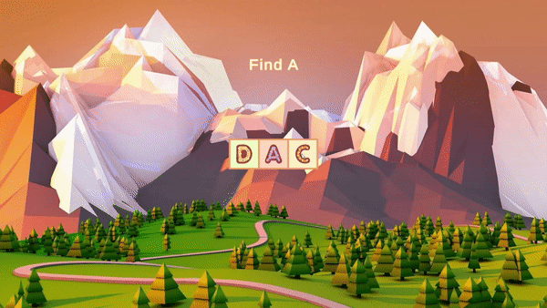

# AmayaSoftTest  
  
**Тестовое задание на Unity Developer в компанию AmayaSoft**  
  
## Геймплей  
  
Цель игры: выбрать правильный вариант ответа, соответствующий заданию.  
  
### Игровой процесс по шагам  
  
* В игре 3 уровня сложности  
  
1-й уровень - Легкий    
  

  

  
2-й уровень - Средний  
  

  

 
  
3-й уровень - Тяжелый  
  

  

  
* При запуске сцены:  
  
  1. Через bounce эффект появляются ячейки с объектами  
  2. Через **FadeIn** эффект появляется текст с заданием, выбрать правильный вариант ответа  
  

  

  
* При тапе на неправильный ответ:  
  
  1. Объект внутри карточки дергается туда-сюда (easeInBounce)  
  

  

  
* При тапе на правильный ответ:  
  
  1. bounce объекта внутри карточки  
  2. Появляются партиклы звездочки  
  

  

  
* При окончании всех уровней:  
  
  1. В центре экрана появляется кнопка **Restart**, нажав на нее можно начать игру заново с легкого уровня  
  2. Должно эффектом **FadeIn/FadeOut** появиться затемнение экрана, но она не должна перекрывать кнопку **Restart**  
  3. Все элементы в игре не должны быть кликабельны  
  

  

  
* При нажатии кнопки **Restart**:    
  
  1. Должен через эффект **FadeIn/FadeOut** появиться загрузочный экран (черная текстура). Игровые объекты исчезают.
  2. Все должно начинаться с пункта /"При запуске сцены/"
  

  

 
  
### Условия генерации данных    
  
* При смене уровня    
  
  1. Правильный ответ выбирается случайным образом. Он не повторяется в рамках сессии, где сессия - запущенный *Play Mode*  
  2. Эффект появления ячеек не происходит. Старые объекты в ячейках удаляются, появляются мгновенно новые. Новые ячейки тоже появляются мгновенно  
  3. Мгновенно меняется текст задания  
  4. При смене уровня может подставится один из двух видов визуализации данных (цифры или буквы). Цель задания меняется в зависимости от объектов. Данная конфигурация должна быть максимально простой и понятной, чтобы потом наборы данных можно было менять без участия разработчика  
  
* Во время генерации уровня учитывать, что правильный вариант овтета только один    
  
* В коде не должно быть разделения на букву/цифру. Механика должна работать с любыми объектами, вне зависимости от того что это. Код одинаковый для обоих случаев, различаются только наборы данных и визуальная составляющая    
  
* Префаб ячейки должен быть единственным в проекте  
  
* Gameplay не должен разделяться на разные сцены, все должно работать на одной сцене  
